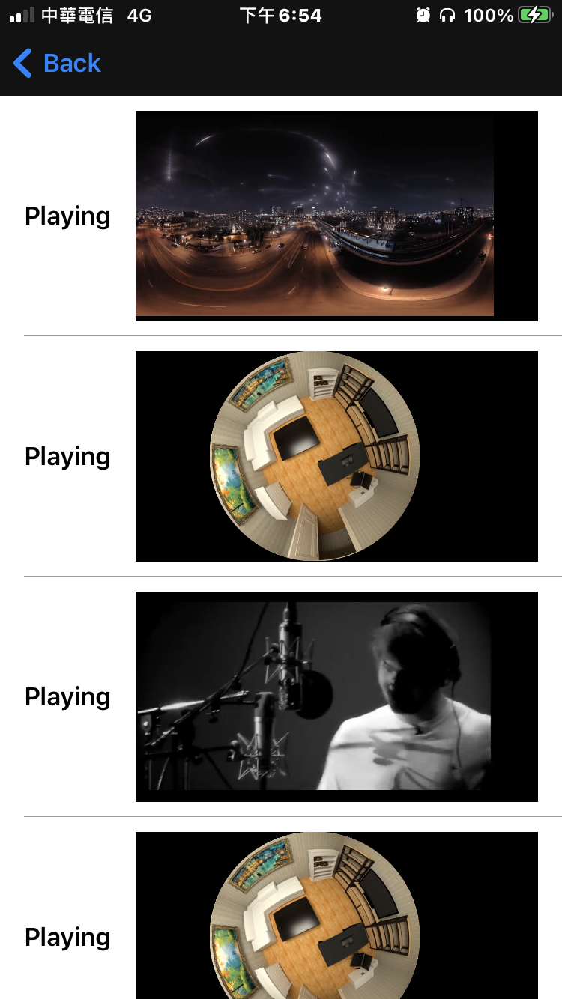
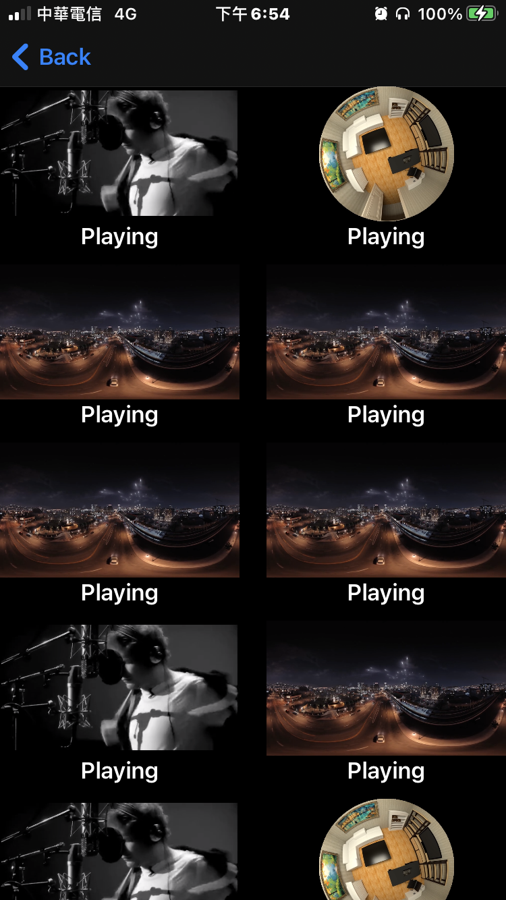

# IRMultiplePlayers 

- IRMultiplePlayers is a multiple video players  for iOS.

- Using the video player([IRPlayer](https://github.com/irons163/IRPlayer)).
- Using MVVM collectionView/tableView stucture([IRCollectionTableViewModel](https://github.com/irons163/IRCollectionTableViewModel)).

## Features
- Using MVVM stucture.
- Support TableView.
- Support CollectionView.

## Install
### Git
- Git clone this project.

## Usage

### Basic
- Set `reuseIdentifier` to every items in the collection view.
```obj-c
NSString *identifier = [NSString stringWithFormat:@"Identifier_%d-%d-%d", (int)indexPath.section, (int)indexPath.row, (int)indexPath.item];
[collectionView registerNib:[UINib nibWithNibName:CollectionViewCell.identifier bundle:nil] forCellWithReuseIdentifier:identifier];

CollectionViewCell *cell = [collectionView dequeueReusableCellWithReuseIdentifier:identifier forIndexPath:indexPath];
```

## Screenshots
| Demo1 | Demo2 |
|:---:|:---:|
|  |  |
| Demo3 | |
|  | |
